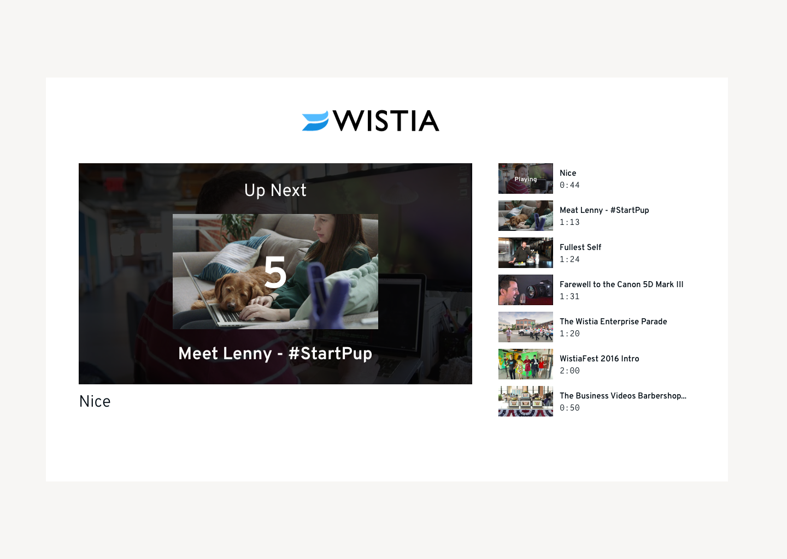

Wistia Full Stack Developer Challenge

# Overview
Enhance an existing lightweight video application with the Wistia API.

# Objective
The goal is to have an interesting discussion about:
  * API practices
  * Modeling databases and queries
  * HTML, CSS and Javascript practices
  * Server side language of choice
  * MVC architectures

We want to know what kinds of engineering paradigms you'd bring to Wistia. We encourage you to use this exercise to showcase what you care about as a developer. If you find yourself taking a "shortcut" to get some functionality, that's okay. We care more that you can discuss the trade-offs of taking an approach that might not be "production-quality".

As your app evolves, feel free to change the app routes, folder structure and starter code as you see fit.

We haven't provided pixel specification so don't worry about pixel-perfection.

# Background
Wistia is a video hosting solution for marketers. We make it easy to upload, manage, share, and track your web video performance. The [Wistia Developer API](https://wistia.com/support/developers) gives you all kinds of programmatic access to your Wistia account and its videos.

# Challenge Details
Your challenge is to submit an application that meets the following acceptance criteria:

## Frontend

* Using the frontend of your choice build a frontend application that contains two views:
  * Public View:
    * Displays an embedded wistia player with playlist functionality.
    * Automatically plays the next video on the playlist.
    * Displays a countdown animation of 5s between when a video ends and the next video begins
    * While the video is playing, the playlist is styled to indicate that it is currently playing
    * Autoplay is disabled after all videos have played
    * Videos are played from the top of the queue. Previous played videos are moved to the bottom of the list
    * Is styled to match this mock 

  * Admin View:
    * Enables visibility toggling 
    * Wire the endpoint to the eye toggle (strikethrough icon represents hidden)
    * Update the playlist landing page to only render videos marked as visible

  * All calls to Wistia should be made from your server application, rather than the client itself.

## Backend

  * Has a dedicated endpoint to manage the video's visibility that is hit when toggling with the strikethrough icon representing hidden.

  * Updates the playlist landing page to only render videos marked as visible

  * Uses non-blocking calls to Wistia's API. 

# Submission Checklist

- Submission meets all sections of Feature Specifications
- Includes a README telling us:
  * How to setup and run your app 
  * The browser and OS used
  * A brief architecture overview of your design
  * An explanation of the solution's performance characteristics
  * Anything you learned or would do differently if doing this again
  * Any other notes you think are relevant

# Starting Point
Here's some links to our docs to help you get started. Any documented piece of the API you find on your own is also fair game in the submitted solution.

Leverage these as much, or as little, as it makes sense to you.

* Javascript Player API methods
  * [play](https://wistia.com/support/developers/player-api#play)
  * [end](https://wistia.com/support/developers/player-api#end)
  * [replaceWith](https://wistia.com/support/developers/player-api#replacewith-hashedid-options)
  * [silent autoplay](https://wistia.com/support/developers/embed-options#silentautoplay)
* [Getting started with Wistia's Data API](https://wistia.com/support/developers/data-api)
* [View video stats](https://wistia.com/support/developers/stats-api)

**Please reach out if you need anything clarified or if you have any questions!**